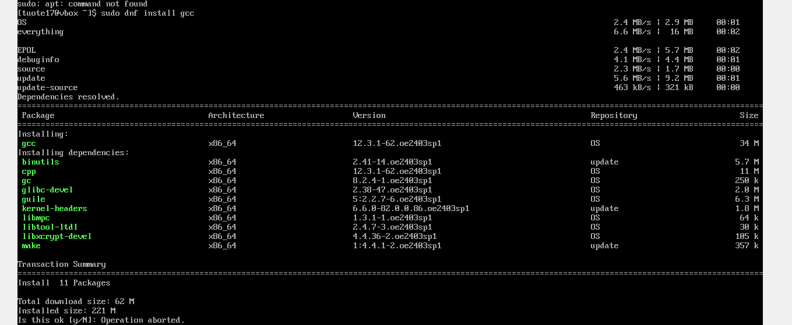
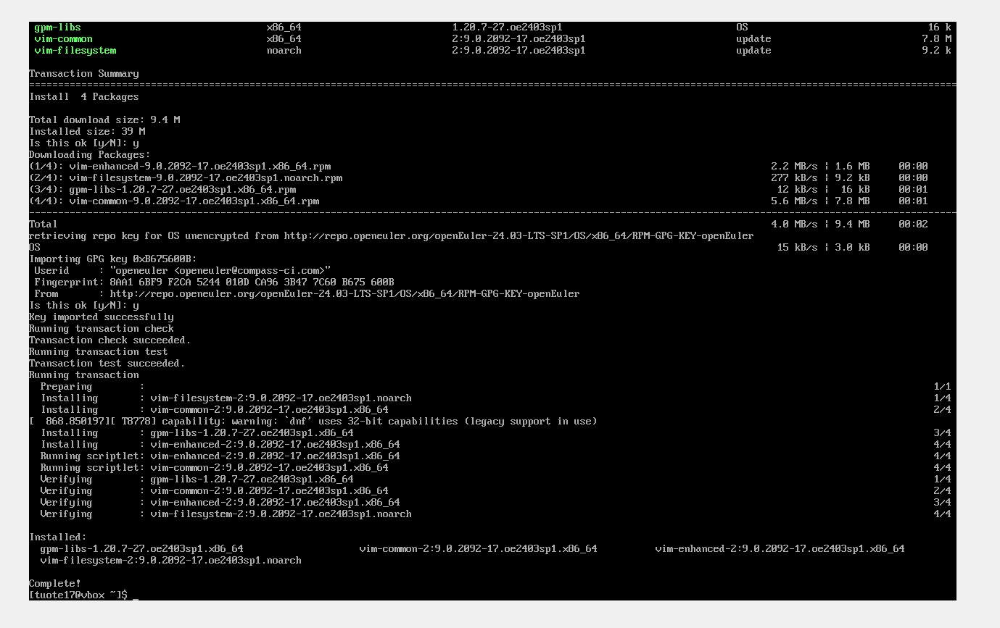
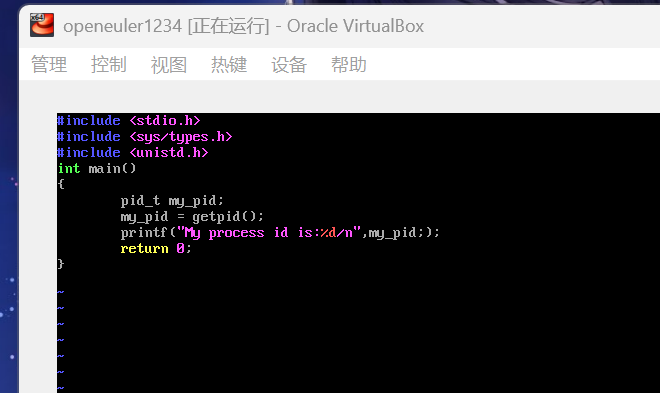
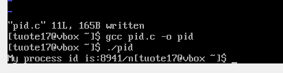
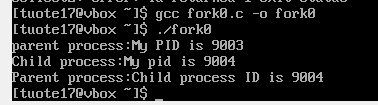
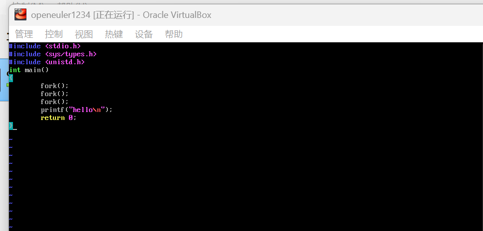
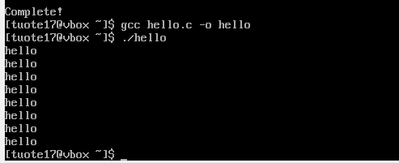
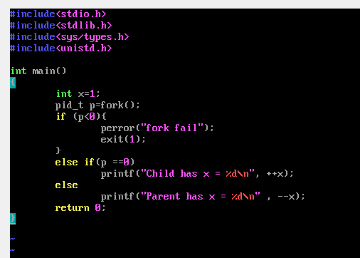
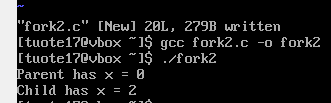

# Linux环境下的C语言代码实践

## 安装环境

**启动虚拟机**，以管理员身份登入后，依次键入如下代码：
**sudo dnf install gcc**

*按y确认*，安装好gcc编译器。

再键入**sudo dnf install vim**,重复如上操作，安装vim。

## 获取进程的PID

### 编写程序
输入指令 **vim pid.c**，使用vim开始编写c程序，点击i输入代码，完成后点击esc，输入 **:wq**保存。

### 编译程序
输入指令 **gsc pid.c -o pid**,将名为pid.c的*源文件*编译成名为pid的*可执行程序*。

### 运行程序
输入指令 **./pid**,运行程序，得到如图所示结果。

## fork()示例0

编写与编译过程和上一节相同，本节和后续节不再赘述。
输入指令 **./fork0**,运行程序，得到如图所示结果。

fork()之后，进程9003和9004**交替运行**，导致先输出父进程的第一个printf，然后子进程的，然后父进程的第二个。

## fork()示例1

输入指令 **./hello**,运行程序，得到如图所示结果。

由于3个fork(),程序变为了1->2->4->8个进程，最后输出了8条语句。

## fork()示例2

输入指令 **./fork2**,运行程序，得到如图所示结果。

程序fork过后，父进程和子进程中的x为两个变量，所以分别输出0和2.