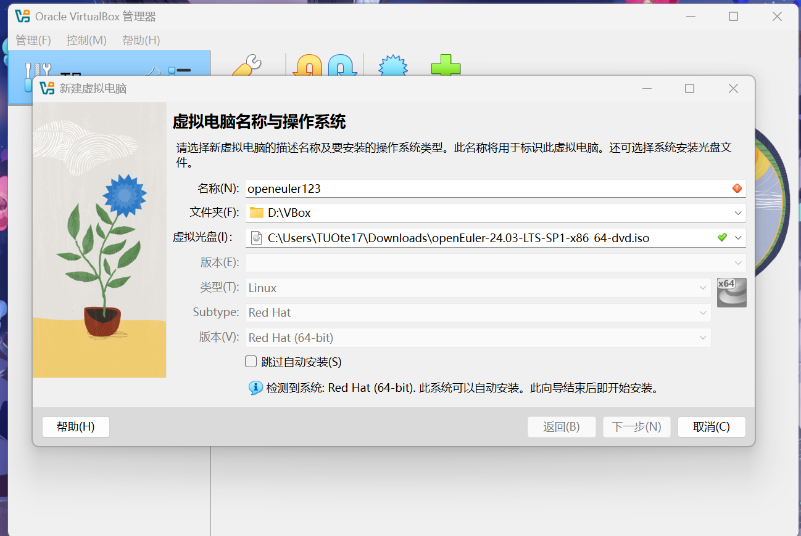

# Openeuler安装报告

## 文件下载

在**Openeuler官网**和**VirtualBox官网**的对应镜像下载所需要的*系统文件*以及*虚拟机文件*。

## 安装虚拟机

安装下载好的Virtualbox虚拟机，选择**新建**,在虚拟光盘中选择刚才下载的openeuler文件。
分配内存，CPU和磁盘空间，点击**完成**创建虚拟机。

## 运行虚拟机

进入虚拟机内的系统安装界面，选择语言为**中文**，点击继续。
进入下一个页面，配置安装目的地和账户，点击开始安装。

## 启动系统

安装完成后自动重启虚拟机，键入回车键并输入**上一步**中配置的*账号与密码*，成功进入系统，安装完成。

