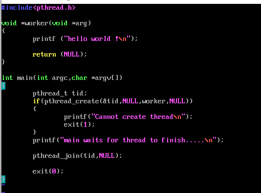
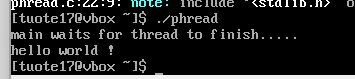
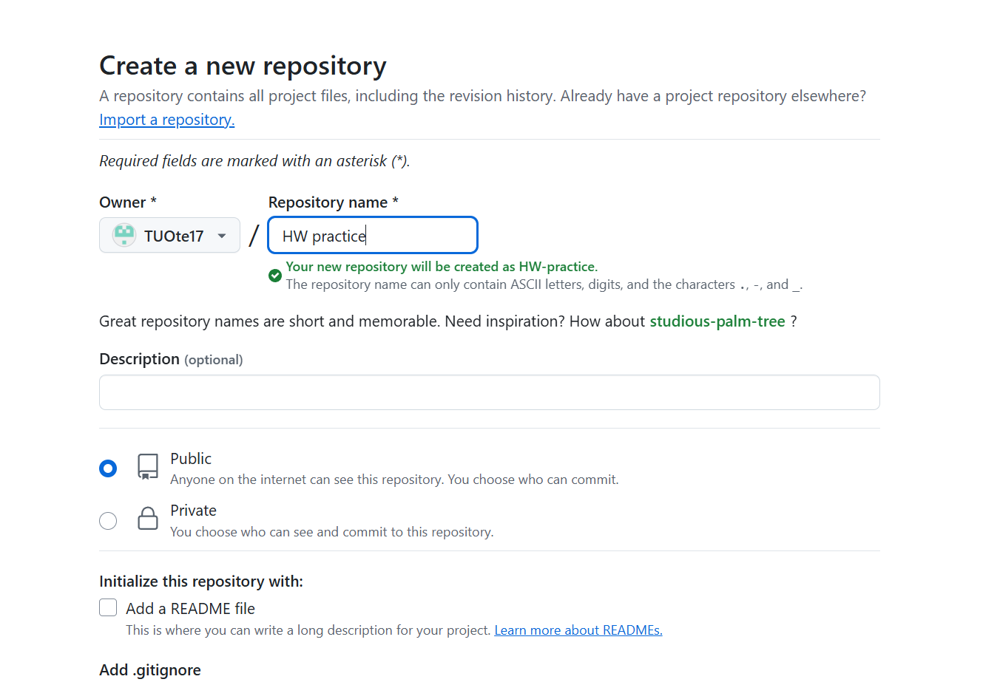
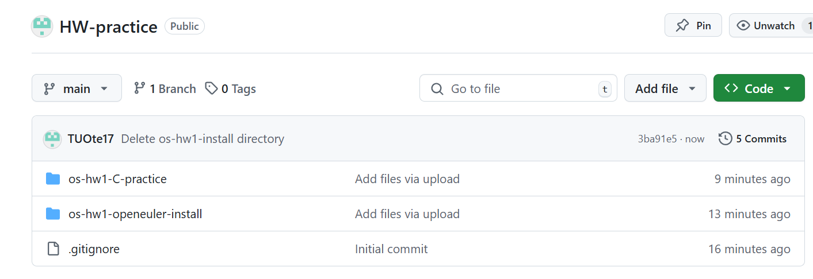

# 多线程代码实践以及git项目创建

## pthread代码

### 编写程序
输入指令 **vim phread.c**，使用vim开始编写c程序，点击i输入代码，完成后点击esc，输入 **:wq**保存。

### 编译程序
输入指令 **gsc phread.c -o phread**,将名为phread.c的*源文件*编译成名为phread的*可执行程序*。

### 运行程序
输入指令 **./phread**,运行程序，得到如图所示结果。

## 创建github库

登录github，创建仓库。

将以前的项目上传至仓库。

