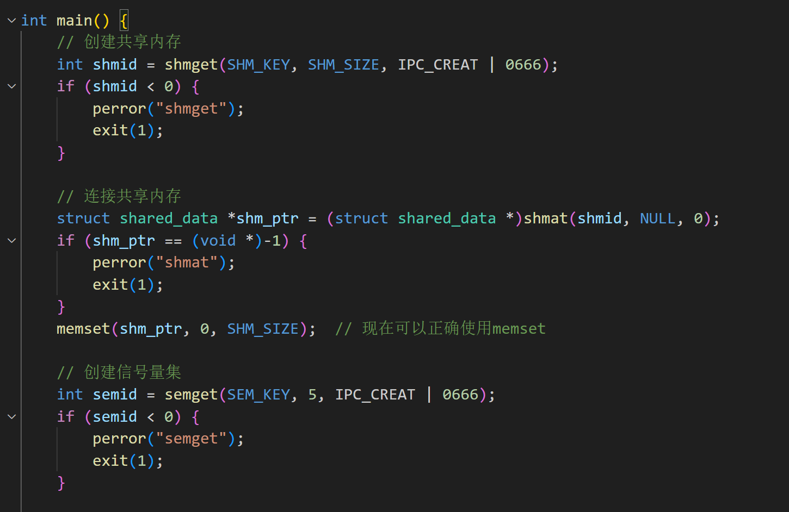
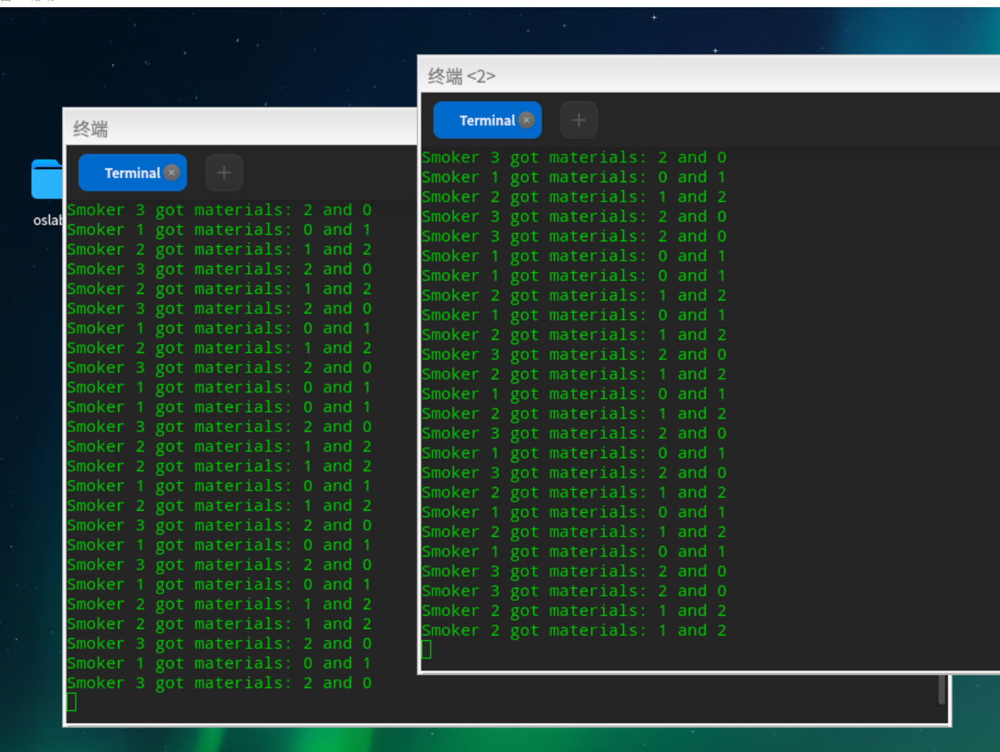

# 进程同步实验报告

## 一、实验概述
### 1.1 实验名称
进程同步实验

### 1.2 实验目的
1. 掌握进程同步与互斥的基本概念
2. 熟悉Linux系统IPC进程同步工具的使用
3. 理解经典同步问题（生产者/消费者、抽烟者问题）的解决方案
4. 掌握共享内存、信号量、消息队列的编程方法


---

## 二、实验内容
### 2.1 生产者-消费者问题
#### 2.1.1 实现原理
- 使用共享内存作为环形缓冲区
- 通过信号量实现：
  - 互斥访问（binary semaphore）
  - 缓冲区满/空条件同步（counting semaphore）

#### 2.1.2 关键代码片段
```c
// 生产者进程
while(1){
    down(prod_sem);   // 等待缓冲区不满
    down(pmtx_sem);   // 获取互斥锁
    // 生产数据
    buff_ptr[*pput_ptr] = 'A' + *pput_ptr;
    printf("生产者%d生产：%c\n", getpid(), buff_ptr[*pput_ptr]);
    *pput_ptr = (*pput_ptr + 1) % buff_num;
    up(pmtx_sem);     // 释放互斥锁
    up(cons_sem);     // 通知消费者
    sleep(rate);
}

// 消费者进程
while(1){
    down(cons_sem);   // 等待缓冲区不空
    down(cmtx_sem);   // 获取互斥锁
    // 消费数据
    printf("消费者%d消费：%c\n", getpid(), buff_ptr[*cget_ptr]);
    *cget_ptr = (*cget_ptr + 1) % buff_num;
    up(cmtx_sem);     // 释放互斥锁
    up(prod_sem);     // 通知生产者
    sleep(rate);
}
```
### 2.2 抽烟者问题

#### 2.2.1 问题描述
**问题场景**：  
三个抽烟者线程需要三种材料（烟草、纸、胶水）才能制作香烟，但每位抽烟者仅持有其中一种材料：
- 抽烟者A：持有烟草  
- 抽烟者B：持有纸  
- 抽烟者C：持有胶水  

**约束条件**：  
1. 两个供应商线程交替提供两种随机材料（如烟草+纸、纸+胶水等）
2. 抽烟者必须等待所需两种材料全部到位后才能制作香烟
3. 材料一旦被取用，供应商需立即补充新的材料组合

#### 2.2.2 实现方案
**核心设计**：  
1. **共享内存**：存储三种材料的实时库存（烟草/纸/胶水）
2. **信号量机制**：  
   - `sem[0-2]`：材料计数信号量（初始值0）
   - `sem[3]`：互斥锁（初始值1）
   - `sem[4]`：供应完成信号量（初始值0）

**同步流程**：  
1. **供应商线程**：  
   - 随机选择两种材料组合进行补充  
   - 通过信号量`sem[m1]`和`sem[m2]`减少对应材料库存  
   - 发送`sem[4]`信号通知抽烟者可进行制作  

2. **抽烟者线程**：  
   - 等待所需两种材料的信号量（`sem[a]`和`sem[b]`）  
   - 消耗材料后通过`sem[4]`通知供应商继续供应  

#### 2.2.3 关键代码片段



```c
// 共享内存结构体
struct shared_data {
    int tobacco;  // 烟草库存
    int paper;    // 纸张库存
    int glue;     // 胶水库存
};

// 供应商线程逻辑
void supplier_thread() {
    int materials[3][2] = {{0,1}, {1,2}, {2,0}}; // 可能的材料组合
    while (1) {
        // 随机选择材料组合
        int idx = rand() % 3;
        int m1 = materials[idx][0];
        int m2 = materials[idx][1];
        
        // 获取互斥锁
        sem_wait(&sem[3]);
        
        // 更新库存
        inventory[m1]--;
        inventory[m2]--;
        
        // 释放互斥锁
        sem_post(&sem[3]);
        
        // 通知抽烟者材料已准备
        sem_post(&sem[4]);
        
        // 短暂休眠模拟供应延迟
        usleep(rand() % 500000);
    }
}

// 抽烟者线程逻辑
void smoker_thread(int need1, int need2) {
    while (1) {
        // 等待所需材料
        sem_wait(&sem[need1]);
        sem_wait(&sem[need2]);
        
        // 获取互斥锁
        sem_wait(&sem[3]);
        
        // 制作香烟（模拟消耗材料）
        printf("Smoker %d 制作香烟\n", getpid());
        
        // 重置库存（实际应用中需补充材料）
        inventory[need1]++;
        inventory[need2]++;
        
        // 释放互斥锁
        sem_post(&sem[3]);
        
        // 通知供应商继续供应
        sem_post(&sem[4]);
        
        // 模拟抽烟耗时
        usleep(rand() % 1000000);
    }
}
```
#### 2.2.4运行结果

