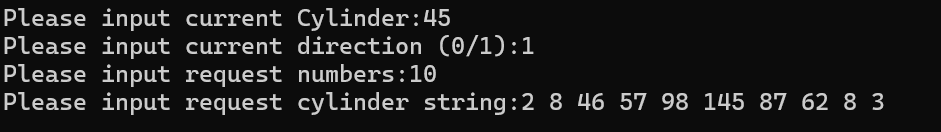
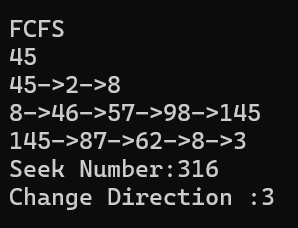
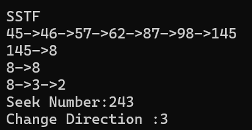
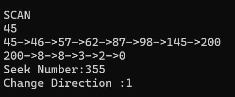
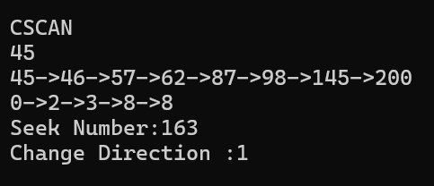
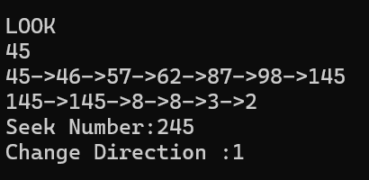

# 磁盘移臂调度算法实验报告

## 一、实验概述
### 1.1 实验名称
磁盘移臂调度算法实验

### 1.2 实验目的
1. 加深对于操作系统设备管理技术的了解，体验磁盘调度算法的重要性
2. 掌握⼏种重要的磁盘调度算法，练习模拟算法的编程技巧，锻炼研究分析实验数据的能⼒

---

## 二、实验内容
### 2.1 测试用例



### 2.2 FCFS方法
#### 2.2.1 原理介绍

先来先服务（First-Come, First-Served, FCFS）是最简单的磁盘调度算法，按照请求到达的顺序依次处理，公平但效率低下。

#### 2.2.2 关键代码片段

```c++
void DiskArm::FCFS() { 
int Current = CurrentCylinder; 
int Direction = SeekDirection; 
  InitSpace("FCFS"); 
std::cout << Current; 
for (int i = 0; i < RequestNumber; i++) { 
bool needChangeDirection = ((Cylinder[i] >= Current)&&!Direction) ||((Cylinder[i] < Current) && Direction); 
if (needChangeDirection) { 
      Direction = !Direction; 
      SeekChange ++; //调头数加1 
//报告当前响应的道号 
std::cout << std::endl << Current << "->" << Cylinder[i]; 
    } 
    
else { 
//不需要调头，报告当前响应的道号 
std::cout << "->" << Cylinder[i]; 
//累计寻道数，响应过的道号变为当前道号 
    SeekNumber += abs(Current - Cylinder[i]); 
    Current = Cylinder[i]; 
  }
} 
//报告磁盘调度情况 
  Report(); 
} 
```

#### 2.2.3 运行结果



### 2.3 FCFS方法
#### 2.3.1 原理介绍

SSTF（Shortest Seek Time First）调度每次选择与当前磁头位置距离最近的请求，以最小化寻道时间。

#### 2.3.2 关键代码片段

```c++
void DiskArm::SSTF(){ 
    int Current = CurrentCylinder; 
    int Direction = SeekDirection; 
    InitSpace("SSTF"); 
    std::cout << Current;
    int *p=new int[RequestNumber];
    for (int i = 0; i < RequestNumber; i++){
        p[i]=Cylinder[i];
    }
    for (int i = 0; i < RequestNumber; i++){ 
    int Minseek = 9999;
    int j;
    for(int k=0;k<RequestNumber;k++){
        if (Minseek>abs(p[k]-Current)){
            j=k;
            Minseek=abs(p[k]-Current);
        }
    }//寻找路径最短的点
    bool needChangeDirection = ((Cylinder[j] >= Current)&&!Direction)|| ((Cylinder[j] < Current) && Direction); 
    if (needChangeDirection) { 
        Direction = !Direction; 
        SeekChange ++; //调头数加1 
        std::cout << std::endl << Current << "->" << Cylinder[j]; 
    } 
    
else { 
std::cout << "->" << Cylinder[j]; 
//累计寻道数，响应过的道号变为当前道号 
    
  }SeekNumber += Minseek; 
  Current = Cylinder[j]; 
  p[j]=-9999;
} 
//报告磁盘调度情况
  delete p;
  Report(); 
} 
```

#### 2.2.3 运行结果



### 2.4 SCAN方法
#### 2.4.1 原理介绍

SCAN 算法将磁臂从一端移动至另一端，在沿途处理所有请求，然后反向继续处理，如电梯般来回移动。

#### 2.4.2 关键代码片段

```c++
void DiskArm::SCAN(){ 
    int Current = CurrentCylinder; 
    int Direction = SeekDirection; 
    InitSpace("SCAN"); 
    std::cout << Current;
    int *p=new int[RequestNumber];
    int temp;
    for (int i = 0; i < RequestNumber; i++)
        p[i]=Cylinder[i];
     for(int i=0;i<2;i++){ 
        std::cout << std::endl << Current;   
        for(;Direction?Current<200:Current>0;Direction?Current++:Current--){
            for(int j=0;j<RequestNumber;j++){
                if(p[j]==Current){
                std::cout << "->" << Cylinder[j];
                p[j]=-1;}
            }
            SeekNumber++;
        }
        std::cout << "->" << Current;
        Direction=!Direction;
     }
     SeekChange=1;
//报告磁盘调度情况
  delete p;
  Report(); 
} 
```

#### 2.4.3 运行结果



### 2.5 CSCAN方法
#### 2.5.1 原理介绍

C-SCAN（Circular SCAN）与 SCAN 类似，但在到达一端后不反向，而是直接返回起始端再开始新一轮扫描。

#### 2.5.2 关键代码片段

```c++
void DiskArm::CSCAN(){ 
int Current = CurrentCylinder; 
    int Direction = SeekDirection; 
    InitSpace("CSCAN"); 
    std::cout << Current;
    int *p=new int[RequestNumber];
    int temp=0;
    for (int i = 0; i < RequestNumber; i++)
        p[i]=Cylinder[i];
     for(int i=0;i<2;i++){ 
        std::cout << std::endl << Current;   
        for(;Direction?Current<200:Current>0;Direction?Current++:Current--){
            for(int j=0;j<RequestNumber;j++){
                if(p[j]==Current){
                std::cout << "->" << Cylinder[j];
                p[j]=-1;
                temp++; 
            }
            }if(temp==RequestNumber)
                break;
            SeekNumber++;
            
        }
        if(i!=1)
        std::cout << "->" << Current;
        Current=Direction?0:200;
     }
     SeekChange=1;
//报告磁盘调度情况
  delete p;
  Report();
} 
```

#### 2.5.3 运行结果



### 2.6 LOOK方法
#### 2.6.1 原理介绍

与 SCAN/C-SCAN 不同，LOOK 调度不会将磁头移动到磁盘两端，而是仅移动至当前方向上最远的请求位置再折返。

#### 2.6.2 关键代码片段

```c++
void DiskArm::LOOK(){ 
    int Current = CurrentCylinder; 
    int Direction = SeekDirection; 
    InitSpace("LOOK"); 
    std::cout << Current;
    int *p=new int[RequestNumber];
    int temp;
    for (int i = 0; i < RequestNumber; i++)
        p[i]=Cylinder[i];
    for (int i = 0; i < RequestNumber - 1; i++){
                for (int j = 0; j < (RequestNumber - 1 - i); j++)
                        if (p[j] > p[j + 1]){
                            temp =p[j];
                            p[j]=p[j+1];
                            p[j+1]=temp;
                        }
     }
     int Max=p[RequestNumber-1];
     for(int i=0;i<2;i++){ 
        std::cout << std::endl << Current;   
        for(;Direction?Current<Max:Current>0;Direction?Current++:Current--){
            for(int j=0;j<RequestNumber;j++){
                if(p[j]==Current){
                std::cout << "->" << p[j];
                p[j]=-1;
            }
        }
            SeekNumber++;
            
        }
        if(i!=1)
        std::cout << "->" << Current;
        Direction=!Direction;
     }
     SeekChange=1;
//报告磁盘调度情况
  delete p;
  Report();
}
```

#### 2.6.3 运行结果

